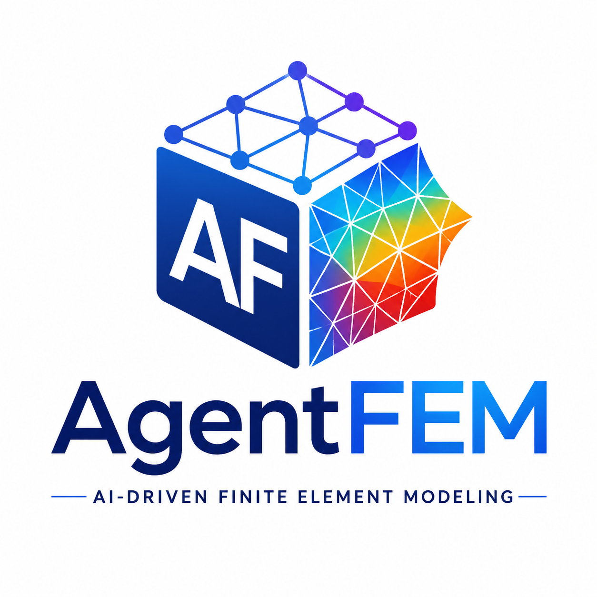

<p align="center"></p>

<h3 align="center">The First Generation of Open-Source AI-Native FEM</h3>
<p align="center"><strong>全球第一代开源 AI 原生有限元平台</strong></p>

# AgentFEM

[](https://github.com/haoming-luo/agentfem/actions/workflows/test.yml)
[](https://pypi.org/project/agentfem/)
[](https://anaconda.org/conda-forge/agentfem)
[](https://www.python.org/)
[](LICENSE)
[](INSTALL.md)

[](https://haoming-luo.github.io/agentfem/assets/papers/agentfem_platform.pdf)

AgentFEM is an open-source finite-element platform that turns an engineering
analysis into a readable Python workflow: define the study, model, materials,
loads, solution procedure, outputs, and verification in one place. The same
workflow can be understood and operated by researchers, scripts, IDEs, future
GUIs, and AI agents.

AgentFEM was initiated by Haoming Luo and open-sourced on GitHub in July 2026.

Its immediate goal is practical: to become a dependable and unusually usable
open-source FEM platform. Its longer-term vision is to make finite-element
simulation an accessible scientific workspace connecting engineering,
computation, data, and AI.

## All You Need Is an Agent

> [!TIP]
> **Give this prompt to Codex, DS Harness, or another AI agent:**

```text
Bring AgentFEM to life.

Use https://github.com/haoming-luo/agentfem as the guide. Follow the
tested route in INSTALL.md, read AGENT_GUIDE.md, and run
`agentfem doctor`.

When it is ready, reply briefly with the environment, AgentFEM
version, and health-check result.
```

AgentFEM includes the guidance and machine-readable interfaces an agent needs.
Prefer manual setup? Continue to [Install](#install).

## Why AgentFEM

- **AI-Native FEM** — finite-element software designed from the start for
  agents to construct, operate, and automate naturally, without replacing
  deterministic mechanics and numerical computation with AI.

- **Humans and Agents, Together** — people and AI agents work through the same
  readable materials, regions, loads, solution steps, and results. AI work
  remains understandable, editable, and reusable by humans.

- **Results You Can Check** — convergence, failures, required outputs,
  benchmark comparisons, and applicability limits remain attached to the
  result instead of being separated from the simulation that produced it.

- **One Run or Thousands** — the same model can support an individual
  analysis, parameter campaigns, parallel execution, restartable studies, and
  reproducible data generation.

- **Simulation to Learning** — results can flow into scientific datasets,
  user-owned models, PyTorch, surrogate models, and high-fidelity fallback
  without rebuilding the workflow around separate glue scripts.

- **Open at Every Layer** — users can begin with a clear engineering workflow
  and still reach operators, UFL, DOLFINx, PETSc, and custom constitutive
  models whenever needed.

> **Our conviction:** Open FEM for everyone. Useful simulation within reach
> with AI. Engineering AI grounded in physical models, observations, and
> verification.

## Install

AgentFEM supports **Linux**, **macOS**, and **Windows through WSL2**.

### Recommended: conda-forge

Install AgentFEM and its compatible FEniCSx/PETSc/MPI foundation together:

```bash
mamba create -n agentfem-env --override-channels -c conda-forge \
  python=3.11 fenics-dolfinx=0.11 agentfem
mamba activate agentfem-env
agentfem doctor
```

On Windows, run these commands inside an Ubuntu WSL2 terminal, then protect
projects and results from distribution removal:

```bash
agentfem workspace --protect
```

<details>
<summary><strong>Mainland China mirror / 中国大陆镜像</strong></summary>

Use the TUNA conda-forge mirror without changing your global conda
configuration:

```bash
mamba create -n agentfem-env --no-rc --override-channels \
  -c https://mirrors.tuna.tsinghua.edu.cn/anaconda/cloud/conda-forge \
  python=3.11 fenics-dolfinx=0.11 agentfem
mamba activate agentfem-env
agentfem doctor
```

The mirror carries byte-identical conda artifacts for synchronized releases
but may briefly lag a new release. See the
[mainland-China installation notes](INSTALL.md)
for verification, PyPI fallback, and cache refresh commands.

</details>

### No environment setup: Complete Runtime

The **Complete Runtime** is the easiest route for a new or offline user. It
bundles AgentFEM, FEniCSx, PETSc, MPI, HDF5, and Gmsh in one verified download:

- **Apple Silicon macOS:** unsigned `.pkg` Preview
- **Windows 10/11:** offline WSL2 Preview

[**Download the latest Complete Runtime →**](https://github.com/haoming-luo/agentfem/releases/latest)

For Windows, extract the complete ZIP, open PowerShell in that folder, and run:

```powershell
powershell -ExecutionPolicy Bypass -File .\Install-AgentFEM.ps1
```

The included `START-HERE.txt` gives the same short contract to people and AI
agents. If WSL is absent, the installer explains how to enable it first. A new
bundle can be tested beside the old runtime, or safely replace it with a
validated backup-and-rollback transaction:

```powershell
powershell -ExecutionPolicy Bypass -File .\Install-AgentFEM.ps1 -Upgrade
```

The installer keeps projects and results in Windows
`Documents\AgentFEMProjects`, visible inside WSL as `~/AgentFEMProjects`.
Use the bundled `Remove-AgentFEM.ps1` instead of manually unregistering the
distribution; the safe remover verifies project custody and retains a recovery
snapshot first.

### Existing FEniCSx environment: PyPI

If you already maintain a compatible FEniCSx environment:

```bash
python -m pip install agentfem
agentfem doctor
```

In mainland China, the same Python package is also available from the TUNA
PyPI mirror; use that route only inside an already compatible FEniCSx/PETSc
environment.

See [`INSTALL.md`](INSTALL.md) for platform and MPI details, or the
[runtime guide](docs/runtime_installers.md) for Preview installation and
integrity checks.

<details>
<summary><strong>Optional integrations</strong></summary>

Optional capabilities stay separate from the core Python package:

```bash
python -m pip install 'agentfem[mesh-formats]'   # Abaqus/NASTRAN meshes
python -m pip install 'agentfem[gmsh]'           # Gmsh model/.msh import
python -m pip install 'agentfem[visualization]'  # ParaView-ready helpers
python -m pip install 'agentfem[ml]'             # PyTorch adapters
```

</details>

Gmsh is an optional, separately licensed GPL component. It is not contained in
the Apache-2.0 Python package; the recommended offline Complete runtime may
aggregate it with its license and corresponding source for a one-click
CAD-to-mesh workflow.

AgentFEM can share a strictly anonymous reliability signal; models, meshes,
parameters, code, paths, and results are never included. Inspect or disable it
with `agentfem telemetry status|off`. See the
[feedback and privacy contract](docs/feedback_and_privacy.md).

## Run Your First Model

Create and run a complete static-solid project in any directory:

```bash
mkdir first-agentfem-model && cd first-agentfem-model
agentfem init --template static-solid .
agentfem check
agentfem run
agentfem inspect
```

The generated `case.py` is ordinary, editable Python. Its public workflow reads
like an engineering analysis:

```python
study = studies.static_solid(dimension=2, assumption="plane_strain")
model = models.create(study=study, mesh=domain, name="cantilever")
u = model.field(fields.displacement(domain, degree=1))

model.material(elasticity.isotropic_elastic(young=210e9, poisson=0.30))
model.clamp(u, on=left)
model.traction((0.0, -1.0e6), on=right)

result = model.step(target=u, name="static_load").solve_result()
result.verify("engineering").require()
```

The CLI gives the same model a repeatable project root, run identity,
structured result manifest, MPI launch path, and machine-readable interface.
You can also run `case.py` directly with Python.

## What Works Today

| Area | Available workflow |
| --- | --- |
| Solid mechanics | Linear and thermoelastic statics; Neo-Hookean and Mooney--Rivlin finite strain; stateful 3D J2 plasticity |
| Heat and dynamics | Steady/transient heat transfer; Newmark and generalized-alpha dynamics; central-difference explicit dynamics |
| Time-dependent materials | Global power-law creep plus material-point Arrhenius, Kachanov--Rabotnov, Sinh, and fatigue assessment tools |
| Fracture interfaces | Fixed-path cohesive interfaces, cyclic cohesive fatigue, mixed-mode driving, cycle jump, rollback, and restart; advanced routes remain experimental |
| Meshes and constraints | Structured/XDMF meshes, optional Gmsh and meshio, reviewed Abaqus project migration, direct C3D10H import, equation constraints, and distributed periodic workflows |
| Results and automation | Unified fields and histories, progress, checkpoints, Golden benchmarks, campaigns, scientific datasets, surrogate validation, and FEM fallback |
| External PDE breadth | One public, case-independent adapter executes all 645 cases across all 11 PDEAgent-Bench families; every family exceeds 60% and the local fixed-solver snapshot passes 558 official accuracy/time gates ([method and evidence](docs/pdeagent_bench.md)) |

AgentFEM records capability maturity explicitly. A working material-point law,
an integrated global solver, and an externally verified analysis are different
levels of evidence; the software does not silently treat them as equivalent.
See the [capability and verification guide](docs/scientific_verification.md)
for the detailed scope.

## Release Examples

- [Static elasticity](examples/static_elasticity_2d.py) — the readable beginner
  workflow.
- [NAFEMS LE10 3D elasticity](examples/nafems_le10_3d.py) — a public curved-
  solid pressure benchmark with stress, displacement, force, energy, and MPI
  evidence.
- [Transient heat transfer](examples/transient_heat_2d.py) — implicit time
  integration, progress, and field output.
- [Wave propagation with an inclusion](examples/wave_packet_inclusion_2d.py) —
  dynamic fields, source amplitude, and boundary models.
- [Abaqus C3D10H periodic cell](examples/abaqus_c3d10h_periodic_cell/) — direct
  mesh/equation import, quasi-incompressible hyperelasticity, and homogenized
  response.
- [J2 plasticity](examples/j2_plasticity_3d.py) and
  [global creep](examples/implicit_creep_relaxation_3d.py) — stateful nonlinear
  material workflows with cutback and restart.
- [Simulation-to-surrogate campaign](examples/static_elasticity_surrogate_campaign.py)
  — accepted FEM data, surrogate validation, applicability guard, and FEM
  fallback.

These are executable release assets with numerical contracts, not only syntax
demonstrations. More examples are indexed in [`examples/`](examples/) and on
the [documentation site](https://haoming-luo.github.io/agentfem/).

## Open and Extensible

AgentFEM has three visible layers:

```text
Engineering workflow
    -> reusable FEM operators, constitutive laws, constraints, and outputs
        -> FEniCSx / DOLFINx / PETSc / MPI numerical kernel
```

Users can stay in the concise engineering workflow or descend to operators,
UFL, DOLFINx, PETSc, and custom constitutive implementations when a research
problem needs a lower layer. This is also the extension path for user
materials, new elements, private domain modules, GUIs, and agent tools.

Learning follows the same rule. A laboratory-owned model can connect directly
through the framework-neutral `model.step(target=spec, executor=...)`
boundary. The optional
[AgentFEM-Learning](https://github.com/haoming-luo/agentfem-learning)
companion provides maintained providers, examples, and benchmark evidence for
selected scientific-learning methods; it is not required to use a user's own
model.

## Documentation

- [Getting started](docs/getting_started.md)
- [Standard modeling workflow](WORKFLOW.md)
- [Engineering concepts](CONCEPTS.md)
- [Scientific functions and theory](docs/reference/scientific_function_reference.md)
- [Results, campaigns, and learning](docs/results_and_campaigns.md)
- [AI-native learning contracts](docs/ai_native_learning.md)
- [AI-agent guide](AGENT_GUIDE.md)
- [Roadmap and release gates](docs/product_roadmap.md)

The complete user and scientific reference is available at
[haoming-luo.github.io/agentfem](https://haoming-luo.github.io/agentfem/).

## Scope

AgentFEM is an early-stage research and engineering platform. It prioritizes
depth, transparent evidence, and a coherent user workflow over claiming every
analysis available in mature general-purpose CAE systems. Current maturity and
known boundaries are documented per capability so users can decide what is
appropriate for exploration, research, or engineering use.

## Citation

If AgentFEM helps your research or engineering work, please cite the project
metadata in [`CITATION.cff`](CITATION.cff). The
[AgentFEM Technical Report](https://haoming-luo.github.io/agentfem/publications/agentfem-platform/),
*AgentFEM: An AI-Native Open-Source Platform for Finite-Element Computing*,
presents the platform's architecture, founding principles, representative
workflows, and author's vision. [Read the PDF](https://haoming-luo.github.io/agentfem/assets/papers/agentfem_platform.pdf).

```yaml
title: "AgentFEM: An AI-native open-source platform for finite-element computing"
version: "0.3.1"
authors:
  - family-names: Luo
    given-names: Haoming
    affiliation: "Materials Department, Xi'an Thermal Power Research Institute (TPRI)"
date-released: 2026-08-30
```

## Author

Haoming Luo is the initiator and maintainer of AgentFEM. His interests include computational mechanics, materials engineering, finite-element simulation, and AI-assisted scientific computing, with education and research experience associated with NWPU, INSA Lyon and Ecole Polytechnique.

The project is also motivated by engineering needs in materials evaluation,
defect inspection, and simulation analysis for power-generation equipment.

## License

AgentFEM is available under the [Apache License 2.0](LICENSE). It can be used,
modified, and extended in research, education, and commercial products under
the terms of that license.
