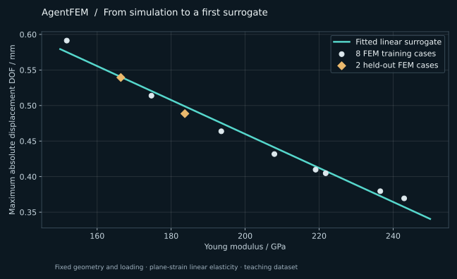

# From simulations to a surrogate model

A single finite-element result answers one question. A parameterized set of
results can answer a family of questions—and become training data for a fast
approximation. The difficult handoff is often not choosing a neural network;
it is keeping track of what was varied, what was computed, and which results
are suitable for learning.

AgentFEM's small elasticity campaign makes that handoff explicit.



*Ten FEM cases, eight for fitting and two held out. This teaching run used
AgentFEM 0.3.3 and DOLFINx 0.11.0. The line is a scalar linear baseline,
not a neural operator.*

## The physical problem

A two-dimensional, plane-strain cantilever is fixed on the left and loaded by
a downward traction on the right. Geometry, mesh, Poisson ratio, and traction
remain unchanged. The Young modulus varies from **150 to 250 GPa**.

The output is the **global maximum absolute displacement degree of freedom**,
in metres. It is not silently substituted with the maximum displacement-vector
magnitude or a selected tip displacement.

## Run the existing example

Want to try the learning step first, without installing a FEM runtime?
The [standalone NumPy mini-lab](https://gist.github.com/haoming-luo/727a217b5b2161a4e81f4ec65aacfc56)
includes the ten FEM outputs, fitting code, units, and provenance. The
[community discussion](https://github.com/haoming-luo/agentfem/discussions/10)
suggests a small physics-based feature experiment.

Use an installed, compatible AgentFEM environment and a matching source
checkout; the repository [example](https://github.com/haoming-luo/agentfem/blob/main/examples/static_elasticity_surrogate_campaign.py)
is not bundled as an executable script in every package installation.
From that checkout's root:

```bash
python examples/static_elasticity_surrogate_campaign.py
```

The default run uses ten Latin-hypercube samples with a fixed seed. It builds
a fresh model for each sample, solves with FEniCSx, applies the declared result
policy, and assembles a scientific dataset. A ridge baseline then uses a
training/validation split and reports its validation result.

```text
Young modulus → finite-element cases → accepted dataset
              → ridge fit → held-out validation → guarded prediction
```

## What the example produces

Under `examples_output/static_elasticity_surrogate_campaign/`:

| Directory | What it preserves |
| --- | --- |
| `campaign/` | Case execution records and campaign artifacts |
| `trusted_dataset/` | Inputs, declared output values, units, and dataset metadata |
| `surrogate/` | The fitted model artifact and associated model information |

The terminal reports validation metrics and the source of the final prediction.
The example's configured relative-L2 threshold is **5%**; that is an
acceptance condition for this demonstration, not a universal accuracy promise.
With only ten cases, the holdout set is small: use this to learn the workflow,
not to establish a broad engineering qualification.

## Why begin without a neural network?

There is only one varying physical input here. A transparent baseline makes
it easier to inspect the dataset and recognize errors before moving to a
higher-dimensional problem. More elaborate models earn their place when the
geometry, spatial fields, loading history, or other inputs warrant them.

AgentFEM provides optional PyTorch integration and user-owned estimator
interfaces. The [learning companion](https://github.com/haoming-luo/agentfem-learning)
adds maintained scientific-learning providers. A neural operator that maps
fields to fields is a different modeling choice from this scalar surrogate.

## Scale the workflow, not the claims

For a new application, first define the inputs, units, output quantity, and
usable parameter range. Then add appropriate sampling, independent test
cases, and a failure policy. The example's guard can fall back to a new FEM
solve when a requested parameter is outside the surrogate's domain.

[Campaign and dataset reference](../results_and_campaigns.md) ·
[Simulation-to-learning guide](../guide/simulation_to_learning.md) ·
[Explore more cases](explore.md)
