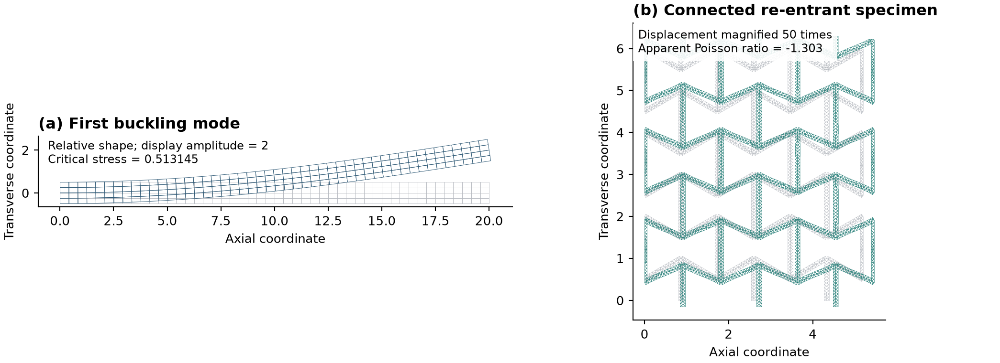
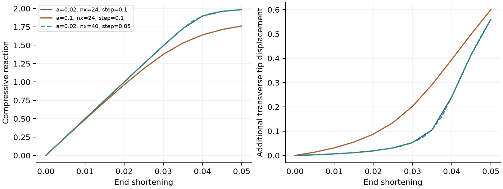
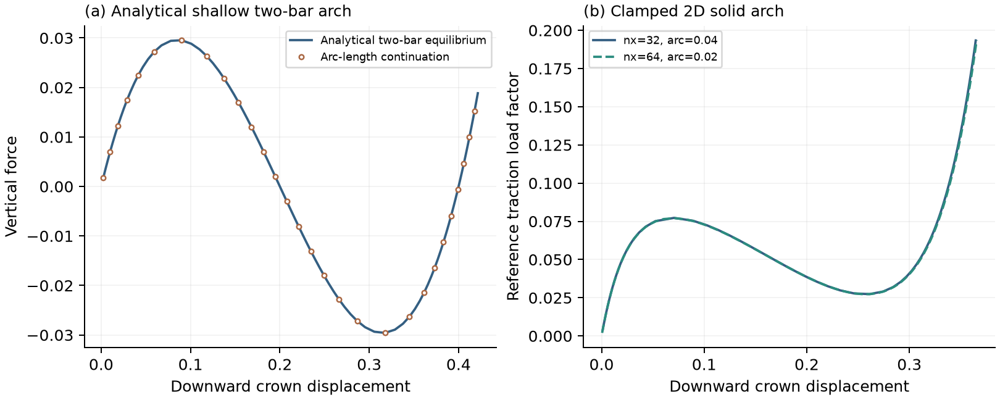

# Solid stability and periodic elastic properties

These experimental public workflows add linear initial-stress buckling and
small-strain periodic homogenization. They do not implement a special column
solver or a special negative-Poisson-ratio material law.



## Linear buckling

Create `studies.buckling_solid(dimension=2, assumption="plane_stress")`
(or plane strain / 3D), register displacement and elastic materials, and define
**homogeneous perturbation supports**. Solve the reference loading separately
with an ordinary static model on the same mesh and material partition. Then:

```python
result = model.step(
    target=u,
    reference_displacement=u_reference,
    reference_name="uniform compressive traction: 1 stress unit",
    modes=3,
).solve_result(output="buckling.xdmf", strict_output=True)
load_factors = result.quantity("load_factors")
```

An optional `base_displacement=...`, `base_name=...` represents a fixed load
that is **not** multiplied by the load factor. The pencil is

\[
(K+K_G(u_b)+\lambda K_G(u_r))\phi=0.
\]

`operators.geometric_stiffness(target, stress)` owns the initial-stress form.
Tension-positive stress means compression destabilizes. Both matrices use
identical free-DOF elimination. The SLEPc backend uses **GNHEP** with
shift-invert near zero: the geometric matrix may be indefinite or singular,
and is not assumed to be a positive-definite modal mass matrix. Positive real
factors are selected; an insufficient accepted spectrum raises an error.
Modes have maximum absolute nodal component one and deterministic sign. Their
amplitudes are relative, not a physical initial imperfection. Repeated modes
can rotate within an eigenspace.

The reference and base fields are copied at Step construction. The caller is
responsible for their equilibrium and matching material assumptions; naming a
state alone does not prove equilibrium. The fixed base must remain stable and
small-displacement. This is not a finite-deformed-base perturbation method.
Only conservative elastic solids and strong supports are covered. Follower
loads, MPC buckling, contact, plasticity and shells remain outside this
delivery. Bounded mode-imperfection, displacement-control and serial spherical
arc-length workflows are described below.

## Periodic elastic properties

Use a load-free `studies.static_solid` model, registered elastic materials and
one displacement field for the periodic fluctuation. Multi-material partitions
must share tags: use `mesh.partition_cells(...)`.

```python
result = mechanics.periodic_elasticity(model, fluctuation, anchor=(0., 0.))
C = result.quantity("effective_stiffness")
E = result.quantity("young_moduli")
nu = result.quantity("poisson_ratios")
```

The geometry is a complete rectangular cell envelope with a matching-node mesh
of its solid phase. The anchor is one solid node, not a maximum-face slave.
Three 2D or six 3D engineering-strain basis cases are solved through ordinary
`model.step(...)`. The strain order is `xx, yy, xy` in 2D and
`xx, yy, zz, yz, xz, xy` in 3D. Shear strain is engineering shear; shear stress
is the tensor component. All stresses and energies are normalized by the
**complete cell envelope**, including void space.

From compliance `S=C^-1`, `E_i=1/S_ii` and `nu_ij=-S_ji/S_ii`, where `i` is the
loading direction and `j` is the transverse direction. No isotropy is assumed.
Plane-strain properties describe the constrained in-plane response rather than
the unconstrained 3D Young modulus. Negative directional Poisson ratios below
-1 can be admissible for anisotropic structures.

Every case records periodic mismatch, reduced-equilibrium residual and
Hill–Mandel energy mismatch; the matrix retains its measured symmetry error
instead of being silently symmetrized. Failed consistency or singular/unstable
stiffness blocks property publication.

### Exact assembled-matrix projection

The workflow explicitly selects
`LinearSolverOptions(mpc_assembly="algebraic")`. It consumes the existing
rectangular MPC graph but forms `T.T @ A @ T` from the ordinary assembled
operator. Numerical matrices remain distributed; root/constraint numbering is
replicated, so extreme-scale graph construction is not claimed. One unit
master per slave and homogeneous essential constraints are required. The
existing `mpc_assembly="native"` default remains unchanged elsewhere.

On the local FEniCSx 0.11 stack, the re-entrant example exposed an approximately
0.9% difference between the native MPC route and explicit algebraic projection,
despite satisfied periodic relations. The native route had a maximum
Hill–Mandel error around 1.3%; explicit projection reduced it to about 2e-12.
This is a reproducible local observation, not a claim that all upstream MPC
versions or formulations are defective. The independent assembled projection
is therefore used for this new homogenization workflow.

## Geometry and finite specimens

`mesh.reentrant_honeycomb(...)` returns a normal mesh and tags, not a solver.
Angle, inclined/vertical ligament length, thickness, repeats and mesh size are
parameters. Default periodic clipping preserves boundary fragments that are
connected through the periodic cell. `connected_specimen=True` retains the
largest connected solid component and removes detached cut fragments for an
ordinary finite specimen. This intentional geometric difference is explicit.
The generator restores a caller's active Gmsh model and mesh-size options.

`mechanics.apparent_poisson_ratio(...)` measures finite-specimen strains using
area-averaged displacements on four named gauge boundaries and explicit gauge
lengths. It rejects near-zero axial strain. It does not label a finite array's
apparent response as a periodic effective property. Applications can provide
other geometries and gauge regions without modifying the solver.

## Reproducible acceptance

- `examples/linear_buckling_column/case.py`: actual static reference solve,
  three modes, XDMF output, Euler reference. A length-20, unit-depth,
  E=1000, nu=0 cantilever gives critical stress about 0.513145 versus Euler
  0.514042 (0.175% difference). Solid and beam theories need not converge to
  exactly the same value at finite slenderness.
- `examples/reentrant_honeycomb/case.py`: periodic cell and connected 3x3
  finite specimen, named gauges and support reactions. For this geometry,
  periodic nu_xy is approximately -1.433, finite-array apparent nu_xy -1.303.
  These are computed predictions, not experimental validation.
- `tests/test_stability_periodic.py`: Euler cantilever and pin–roller supports,
  reference-load and length scaling, fixed-base superposition, 2D/3D agreement,
  solid-cell parameter recovery, two-material series/parallel reference,
  negative-Poisson cell, amplitude independence, energy and gauge checks.
- `tests/stability_periodic_evidence_driver.py`: mesh refinement records in
  `evidence/stability_periodic/2026-10-10.json`. Refining the honeycomb from
  h=0.07 to 0.04 changes nu_xy by about 0.011%, but shear stiffness still
  changes about 1.6%; do not infer all-observable mesh convergence from nu alone.

Run in `fenicsx-env`; MPI acceptance uses the same tests with two ranks. The
honeycomb requires optional Gmsh and the periodic graph requires dolfinx_mpc.

## Next isolated increments

1. Extend the bounded imperfection and displacement-control workflow to more
   geometry orders, materials and independent postbuckling references.
2. Distributed and transaction-aware adapters for the new sparse continuation
   core; retain the independently validated cohesive-specific path.
3. Oblique/nonmatching periodic cells and large-strain response as separate
   extensions, sharing the existing field, state and output contracts.

## References

- [FEniCSx solid buckling derivation](https://bleyerj.github.io/comet-fenicsx/tours/eigenvalue_problems/buckling_3d_solid/buckling_3d_solid.html)
- [SLEPc eigenproblem types](https://slepc.upv.es/release/documentation/manual/eps.html)
- [FEniCSx periodic elasticity](https://bleyerj.github.io/comet-fenicsx/tours/homogenization/periodic_elasticity/periodic_elasticity.html)
- [Abaqus eigenvalue buckling](https://docs.software.vt.edu/abaqusv2025/English/SIMACAEANLRefMap/simaanl-c-eigenbuckling.htm)
- [COMSOL homogenization](https://www.comsol.com/support/learning-center/article/Homogenization-of-Material-Properties-80311)

## Mode imperfections and displacement-controlled response

An additional bounded workflow is now provided by `examples/imperfect_column`.
The existing displacement-based neo-Hookean solver already provides consistent
tangents, adaptive increments, failed-attempt rollback and accepted snapshots;
this workflow reuses it rather than introducing another nonlinear solver.

```python
receipt = mesh.apply_mode_imperfection(
    domain, [buckling_result.field("Buckling_mode_1")], amplitudes=[0.02]
)
# Build a fresh nonlinear model on the perturbed, stress-free geometry.
# Keep moving boundaries through tagged_boundary_region, not old x==L predicates.
# After the ordinary model.step(...).solve_result():
curve = mechanics.displacement_controlled_response(model, step, on=loaded_end)
# receipt.restore() restores original coordinates when the deformed model is no longer used.
```

Amplitudes have length units. Each mode is normalized by its maximum vector norm
at geometry nodes; multiple signed amplitudes can be combined. Original geometry
is retained in the receipt. Failed quality/orientation checks restore coordinates.
The current scope is full-dimensional linear-coordinate triangle, quadrilateral,
tetrahedron and hexahedron meshes; displacement/mode fields may be higher order.
Do not reuse assembled operators or geometric search trees after a geometry edit.

Curve extraction currently supports ordinary strong-boundary, single-material
hyperelastic displacement loading, without body/traction loads, eigenstrains or
boundary models. Reaction and monitor displacement are signed; the example plots
compression and shortening as positive. Measurements use the reference boundary
area, not a nodal-average surrogate. Save every accepted increment for a complete
accepted-step curve. This is not a general arc-length or snap-back algorithm.



For the guided-end example, at shortening 0.05, increasing initial amplitude
from 0.02 to 0.10 changes compression force from 1.98445 to 1.76232. Refining
nx=24 to 40 and halving maximum increment changes the small-imperfection final
force by about 0.010% and transverse displacement by about 0.017%. These are
internal refinement checks, not independent commercial-software validation.

## Sparse spherical arc-length continuation

The physics-independent `solvers.ArcLengthPath` consumes an internal-force and
consistent-tangent callback, a reference load vector, and optionally a fixed load:

\[
\mathbf r(\mathbf u,\lambda)
=\mathbf f_{\rm int}(\mathbf u)-\mathbf f_0-\lambda\mathbf f_{\rm ref}=0.
\]

Here u denotes the free unknowns, lambda the load multiplier, f0 the fixed load,
and fref the scalable reference load. The accepted displacement/load increment
is constrained by

\[
g=\frac{1}{n}\sum_{i=1}^n\left(\frac{\Delta u_i}{u_*}\right)^2
 +\left(\frac{\Delta\lambda}{\lambda_*}\right)^2-\Delta s^2=0.
\]

The user declares positive displacement and load scales u* and lambda*; n is the
number of free unknowns and delta-s the dimensionless arc length. RMS scaling
reduces the trivial dependence on the number of unknowns, but is not a spatial
mass-matrix metric or a guarantee of mesh-independent stepping. Changing scales
changes sampling of a path, not its equilibrium equation.

The corrector solves the bordered Newton system for displacement and load
simultaneously, using K = derivative of fint with respect to u:

\[
\begin{bmatrix}
\mathbf K &-\mathbf f_{\rm ref}\\
2\Delta\mathbf u^T\mathbf W &2\Delta\lambda/\lambda_*^2
\end{bmatrix}
\begin{bmatrix}\delta\mathbf u\\\delta\lambda\end{bmatrix}
=-\begin{bmatrix}\mathbf r\\g\end{bmatrix},
\qquad W_{ii}=1/(n u_*^2).
\]

It does not require inversion of K at a limit point. A tangent predictor is
oriented using the previous accepted increment; failed correctors reduce the
arc length while retaining the accepted state. Both force equilibrium and the
arc constraint must converge. Callbacks must be stateless: irreversible material
commit/rollback belongs to a future transaction-aware adapter. This algorithm
is a spherical method, not a claim of reproducing Abaqus modified Riks exactly.

The first FEniCSx adapter is available through the ordinary public Step route:

```python
step = model.step(
    target=u,
    procedure=procedures.arc_length(),
    arc_options=solvers.ArcLengthOptions(
        initial=0.04, maximum=0.04,
        displacement_scale=0.2, load_scale=0.1,
    ),
    increments=80,
)
result = step.solve_result()
frame = step.displacement_at(20)  # copy of zero-based accepted increment
```

This adapter supports **serial** 2D/3D displacement-based hyperelasticity,
homogeneous strong supports, and proportional dead body forces/tractions.
No follower pressures, independent load amplitudes, contact, MPC, nonzero
prescribed-displacement paths, plasticity or irreversible damage are included.
Distributed execution is rejected explicitly rather than silently gathering a
large model. Reference coefficients must remain fixed during the analysis.
An initially equilibrated generic algebraic state can include a fixed load;
the first FE adapter starts at zero reference load without a separate preload.

Verification includes an analytical two-bar shallow arch (including load
reversal), 2D/3D homogeneous hyperelastic patches, and the continuum solid arch
below with mesh/step refinement. The solid arch crosses two load limit points;
no automatic bifurcation branch switching is claimed. Its static descending
branch must not be mistaken for a time-resolved snap-through trajectory.



See `examples/shallow_arch_arc_length`, `tests/test_arc_length.py` and
`evidence/stability_periodic/arc_length.json` for reproducible results.
The existing stateful cohesive-specific continuation remains unchanged.
For the engineering distinction between static path following, proportional
loading and dynamic collapse, see the
[Abaqus postbuckling guide](https://docs.software.vt.edu/abaqusv2025/English/SIMACAEANLRefMap/simaanl-c-postbuckling.htm).
