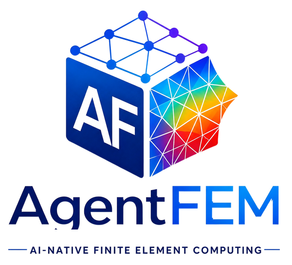

<div class="af-home-lead">
  
  <div class="af-home-lead__copy">
    <h1>AgentFEM</h1>
    <p>AgentFEM is an open-source platform for <strong>AI-native finite-element computing</strong>. It provides a readable engineering workflow for defining, solving, inspecting, and reusing finite-element models while keeping the numerical formulation and result evidence accessible.</p>
  </div>
</div>

<div class="af-project-meta" markdown>

[GitHub](https://github.com/haoming-luo/agentfem) ·
[PyPI](https://pypi.org/project/agentfem/) ·
[Installation](getting_started.md) ·
[Examples](examples/index.md) ·
[Python API](reference/api.md) ·
[Release 0.2.5](release_0.2.5.md) ·
[Apache-2.0 license](licensing.md)

</div>

## Start here

| I want to... | Go to... |
| --- | --- |
| Install AgentFEM and run one model | [Getting started](get_started/index.md) |
| Build a solid, thermal, dynamic, or creep analysis | [User guide](guide/index.md) |
| Reproduce an executable capability | [Examples](examples/index.md) |
| Operate AgentFEM with a coding agent | [For AI agents](agents/index.md) |
| Look up an equation, output variable, or function | [Theory and reference](reference/index.md) |

The public workflow follows the concepts used in an engineering analysis:

```text
Study → Model → Mesh/Regions → Fields → Materials → Loads/Constraints
      → Solution Step → Results/Verification
```

## Quick installation

AgentFEM currently expects a compatible FEniCSx/PETSc/MPI environment. The
recommended installation is:

```bash
mamba create -n agentfem-env -c conda-forge \
  python=3.11 fenics-dolfinx=0.11 mpich mpi4py petsc4py h5py
mamba activate agentfem-env
python -m pip install agentfem
agentfem doctor
```

Windows users should currently use WSL2. Optional mesh, visualization, and
machine-learning integrations are described in the
[installation and platform guide](getting_started.md).

## First finite-element model

The following complete example solves a two-dimensional linear-elastic
cantilever. The left boundary is fixed and a traction is applied on the right.

```python
from mpi4py import MPI

from agentfem import fields, mesh, models, studies
from agentfem.constitutive import elasticity

study = studies.static_solid(
    dimension=2,
    assumption="plane_stress",
)
domain = mesh.rectangle(
    (0.0, 0.0),
    (1.0, 0.2),
    (40, 8),
    comm=MPI.COMM_WORLD,
    cell_type="triangle",
)
model = models.create(study=study, mesh=domain, name="cantilever")

u = model.field(fields.displacement(domain, degree=1))
model.material(
    elasticity.isotropic_elastic(
        young=210.0e9,
        poisson=0.30,
        density=7800.0,
    )
)

left = mesh.face(domain, axis="x", value=0.0, name="left", tag=1)
right = mesh.face(domain, axis="x", value=1.0, name="right", tag=2)
model.fix(u, on=left)
model.traction((0.0, -1.0e6), on=right)

model.check()
result = model.step(target=u).solve_result(output="cantilever.xdmf")
result.verify("engineering").require()
result.write_manifest("cantilever.result.json")

print(model.tree())
print(result)
```

Save the code as `cantilever.py` and run:

```bash
python cantilever.py
```

The analysis produces displacement and standard stress/strain fields in
XDMF/HDF5, together with a structured result manifest containing quantities,
artifacts, solver evidence, and verification state. The repository's
[release example](https://github.com/haoming-luo/agentfem/blob/main/examples/static_elasticity_2d.py)
adds a Golden benchmark and explicit release-quality checks.

## Browse by task

| Topic | Start here |
| --- | --- |
| Create and run an installed project | [Getting started](get_started/index.md) |
| Linear, nonlinear, and thermoelastic solids | [Solid mechanics](guide/solid_mechanics.md) |
| Steady and transient temperature problems | [Heat transfer](guide/heat_transfer.md) |
| Standard and Explicit structural dynamics | [Dynamics and waves](guide/dynamics.md) |
| Plasticity, creep, state, and cutback | [Creep and inelasticity](guide/creep_and_inelasticity.md) |
| Meshes, regions, loads, and constraints | [Model definition](guide/model_setup.md) |
| Fields, histories, output, and post-processing | [Results](guide/results.md) |
| Campaigns, datasets, user models, and surrogates | [Simulation to learning](guide/simulation_to_learning.md) |

## Current scope

| Area | Available workflow |
| --- | --- |
| Solid mechanics | Linear elasticity, thermoelasticity, Neo-Hookean and Mooney--Rivlin finite strain, mixed displacement-pressure hyperelasticity, stateful small-strain J2, and experimental finite-strain J2 strong/affine-MPC providers |
| Heat transfer | Steady conduction and implicit transient heat transfer |
| Dynamics | Newmark/generalized-\(\alpha\) implicit dynamics and central-difference explicit wave propagation |
| Time-dependent materials | Global isothermal/Arrhenius power-law creep plus reviewed material-point creep/damage tools |
| Mesh and constraints | Structured/XDMF meshes, optional Gmsh and meshio routes, direct Abaqus C3D10H import, equation constraints, and distributed periodic workflows |
| Results and verification | Standard fields, histories, resultants, progress, checkpoints, Golden benchmarks, and explicit quality policies |
| Simulation and learning | Parameter campaigns, scientific datasets, user-model execution, NumPy/PyTorch adapters, surrogate baselines, applicability guards, and FEM fallback |

Capabilities with different maturity levels are identified in the relevant
guide and example instead of being presented as equally complete.

## Theory and reference

Engineering definitions are part of the documentation contract. The
[theory and conventions](reference/theory_and_conventions.md) page collects the
governing equations, kinematic conventions, analysis-procedure distinctions,
and links to the detailed material and output definitions. The
[scientific function reference](reference/scientific_function_reference.md)
is generated from reviewed knowledge cards and records formulas, assumptions,
tests, benchmarks, consumers, and known limitations.

Use the reference according to the question being asked:

- [Theory and conventions](reference/theory_and_conventions.md) — governing
  equations, measures, signs, and analysis assumptions.
- [Output variables and field semantics](result_field_semantics.md) — meanings
  of `U`, `S`, `E`, `LE`, `PE`, `CE`, `MISES`, energies, recovery, and
  visualization fields.
- [Scientific operator contracts](operator_contracts.md) — composition of
  \(\mathbf{K}\), \(\mathbf{M}\), \(\mathbf{C}\), \(\mathbf{F}\), residuals,
  and tangents.
- [Python API](reference/api.md) — public signatures and call-level lookup.
- [Examples](examples/index.md) — executable workflows and their numerical
  maturity.

## Humans and agents

AI-native does not mean replacing finite-element computation with AI. Humans,
scripts, IDEs, future GUIs, and AI agents operate the same public model and
structured result contract. Advanced users can still reach UFL, DOLFINx,
PETSc, MPI, and custom constitutive implementations when a problem requires a
lower layer.

AgentFEM was initiated by Haoming Luo and open-sourced on GitHub in July 2026.
